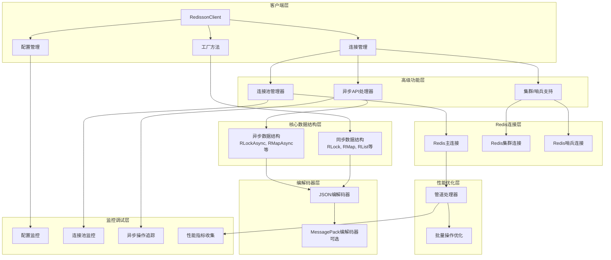
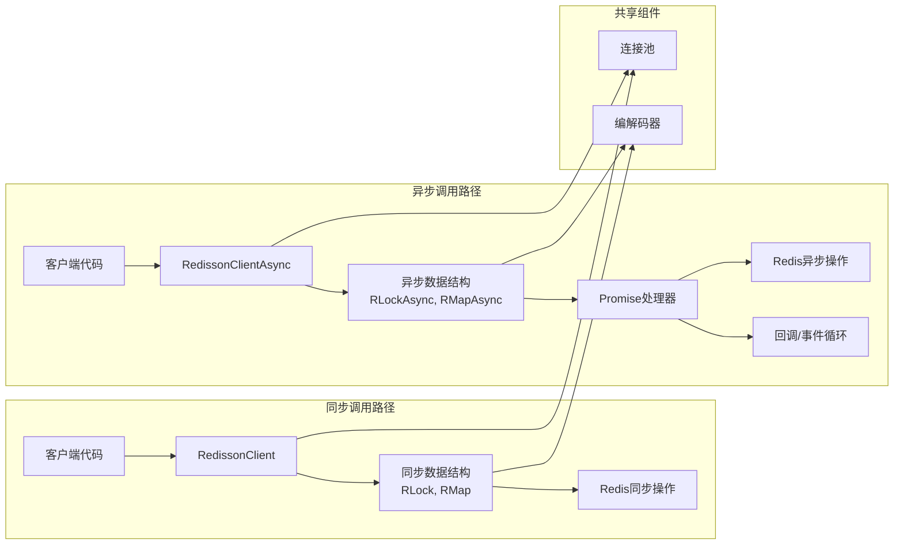
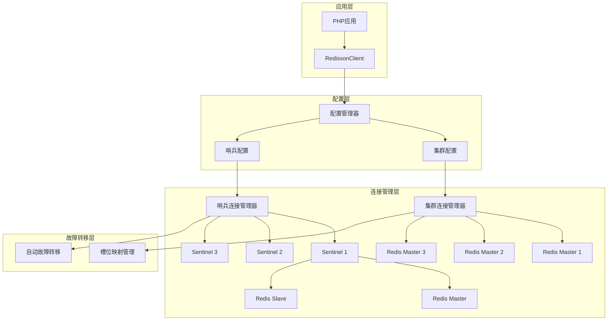
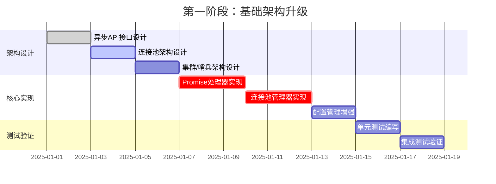
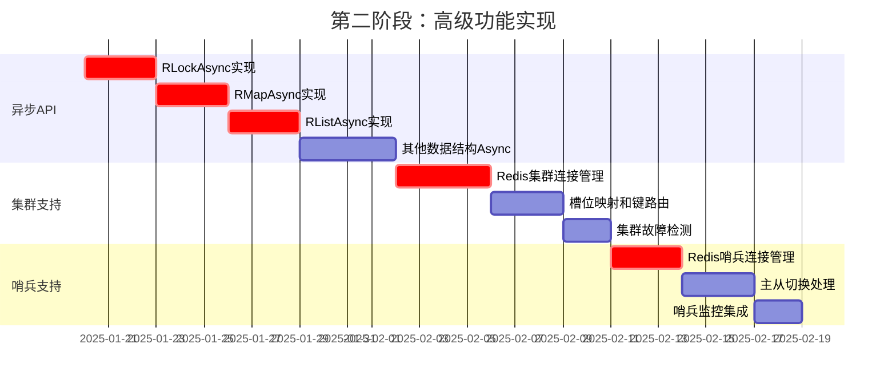
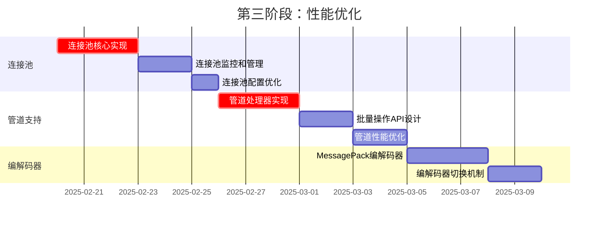
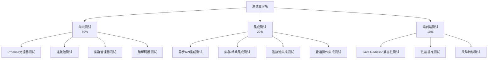

# redi.php 未来增强计划 - 技术架构方案

## 1. 项目现状分析

### 已完成功能 ✅
- **18个核心数据结构**：RMap, RList, RSet, RSortedSet, RQueue, RDeque, RLock, RReadWriteLock, RSemaphore, RCountDownLatch, RAtomicLong, RAtomicDouble, RBucket, RBitSet, RBloomFilter, RTopic, RPatternTopic, RHyperLogLog, RGeo, RStream, RTimeSeries
- **100% Redisson兼容性**：JSON编码、Lua脚本原子操作、一致的键命名约定
- **完整测试覆盖**：单元测试、集成测试、兼容性测试
- **文档和示例**：详细文档、使用示例、专业数据结构演示

### 待增强功能 🚀
根据ARCHITECTURE.md和TODO.md，主要增强方向为：
1. **高级功能**：异步/Promise API、集群支持、哨兵支持
2. **性能优化**：连接池、管道支持、批量操作、MessagePack编解码器
3. **开发者体验**：更好的错误信息、调试日志、性能分析
4. **功能完善**：真正的阻塞操作、增强的发布/订阅

## 2. 技术架构设计

### 2.1 整体架构图



### 2.2 异步API架构



### 2.3 集群/哨兵架构



## 3. 实施优先级和路线图

### 3.1 第一阶段：基础架构升级（1-2周）

**目标**：建立异步和集群支持的基础架构



### 3.2 第二阶段：高级功能实现（2-3周）

**目标**：实现异步API和集群/哨兵支持



### 3.3 第三阶段：性能优化（1-2周）

**目标**：实现连接池、管道和批量操作



## 4. 详细技术方案

### 4.1 异步API实现方案

#### 4.1.1 Promise处理器设计

```php
// 核心Promise接口
interface PromiseInterface {
    public function then(callable $onFulfilled, callable $onRejected = null): PromiseInterface;
    public function catch(callable $onRejected): PromiseInterface;
    public function finally(callable $onFinally): PromiseInterface;
    public function wait();
}

// Redis异步操作包装器
class RedisPromise implements PromiseInterface {
    private $value;
    private $reason;
    private $state = 'pending'; // pending, fulfilled, rejected
    private $handlers = [];
    
    // 实现Promise逻辑...
}
```

#### 4.1.2 异步数据结构示例

```php
// 异步锁实现
class RLockAsync {
    private $redis;
    private $name;
    private $promiseFactory;
    
    public function lockAsync(int $leaseTime = -1): PromiseInterface {
        return $this->promiseFactory->create(function($resolve, $reject) use ($leaseTime) {
            // 异步获取锁逻辑
            $result = $this->tryLockAsync($leaseTime);
            if ($result) {
                $resolve(true);
            } else {
                $reject(new LockException("Failed to acquire lock"));
            }
        });
    }
}
```

### 4.2 连接池实现方案

#### 4.2.1 连接池管理器

```php
class ConnectionPool {
    private $config;
    private $availableConnections = [];
    private $busyConnections = [];
    private $maxConnections;
    private $minConnections;
    private $connectionFactory;
    
    public function getConnection(): Redis {
        // 从池中获取连接或创建新连接
    }
    
    public function releaseConnection(Redis $connection): void {
        // 归还连接到池中
    }
    
    public function createConnection(): Redis {
        // 创建新连接
    }
}
```

#### 4.2.2 连接池配置

```php
$poolConfig = [
    'max_connections' => 50,      // 最大连接数
    'min_connections' => 5,       // 最小连接数
    'connection_timeout' => 5.0,  // 连接超时
    'idle_timeout' => 300,        // 空闲超时
    'max_wait_time' => 10.0,      // 最大等待时间
];
```

### 4.3 集群/哨兵支持方案

#### 4.3.1 集群连接管理器

```php
class RedisClusterManager {
    private $seedNodes;           // 种子节点
    private $slotCache;           // 槽位缓存
    private $connections;         // 节点连接
    private $clusterState;        // 集群状态
    
    public function __construct(array $seedNodes) {
        $this->seedNodes = $seedNodes;
        $this->initializeCluster();
    }
    
    private function initializeCluster(): void {
        // 连接种子节点，获取集群信息
        // 建立槽位映射
        // 创建节点连接池
    }
    
    public function getConnectionForKey(string $key): Redis {
        // 计算槽位，返回对应节点连接
        $slot = $this->calculateSlot($key);
        return $this->getConnectionForSlot($slot);
    }
}
```

#### 4.3.2 哨兵连接管理器

```php
class RedisSentinelManager {
    private $sentinels;           // 哨兵节点列表
    private $masterName;          // 主节点名称
    private $currentMaster;       // 当前主节点
    private $slaves;              // 从节点列表
    private $sentinelConnections; // 哨兵连接
    
    public function __construct(array $sentinels, string $masterName) {
        $this->sentinels = $sentinels;
        $this->masterName = $masterName;
        $this->discoverMaster();
    }
    
    private function discoverMaster(): void {
        // 查询哨兵获取主节点信息
        // 建立主从连接
        // 设置故障转移监听
    }
    
    public function getMasterConnection(): Redis {
        // 返回当前主节点连接
    }
    
    public function getSlaveConnection(): Redis {
        // 返回从节点连接（用于读操作）
    }
}
```

### 4.4 性能优化方案

#### 4.4.1 管道处理器

```php
class PipelineProcessor {
    private $redis;
    private $commands = [];
    private $inPipeline = false;
    
    public function startPipeline(): void {
        $this->inPipeline = true;
        $this->commands = [];
    }
    
    public function addCommand(string $command, array $args): void {
        if (!$this->inPipeline) {
            throw new \RuntimeException("Not in pipeline mode");
        }
        $this->commands[] = ['cmd' => $command, 'args' => $args];
    }
    
    public function executePipeline(): array {
        // 批量执行命令，返回结果数组
        $this->redis->multi();
        foreach ($this->commands as $command) {
            call_user_func_array([$this->redis, $command['cmd']], $command['args']);
        }
        $results = $this->redis->exec();
        $this->inPipeline = false;
        $this->commands = [];
        return $results;
    }
}
```

#### 4.4.2 批量操作API

```php
// 批量操作接口
interface BatchOperationsInterface {
    public function batchPut(array $items): array;     // 批量插入
    public function batchGet(array $keys): array;      // 批量获取
    public function batchDelete(array $keys): int;     // 批量删除
}

// RMap批量操作实现
class RMapBatchOperations implements BatchOperationsInterface {
    private $redis;
    private $name;
    private $pipelineProcessor;
    
    public function batchPut(array $items): array {
        $this->pipelineProcessor->startPipeline();
        foreach ($items as $key => $value) {
            $this->pipelineProcessor->addCommand('hSet', [$this->name, $key, json_encode($value)]);
        }
        return $this->pipelineProcessor->executePipeline();
    }
}
```

## 5. 测试策略

### 5.1 测试金字塔



### 5.2 关键测试场景

#### 5.2.1 异步API测试
- Promise链式调用测试
- 错误处理和恢复测试
- 并发异步操作测试
- 超时和取消测试

#### 5.2.2 连接池测试
- 连接获取和释放测试
- 连接池大小限制测试
- 连接超时和重试测试
- 连接泄漏检测测试

#### 5.2.3 集群/哨兵测试
- 节点故障检测测试
- 自动故障转移测试
- 槽位重新分配测试
- 网络分区处理测试

#### 5.2.4 性能测试
- 连接池性能基准测试
- 管道操作吞吐量测试
- 集群模式性能测试
- 与Java Redisson性能对比测试

## 6. 风险评估和缓解策略

### 6.1 技术风险

| 风险 | 影响 | 概率 | 缓解策略 |
|------|------|------|----------|
| 异步API兼容性问题 | 高 | 中 | 充分测试，提供同步/异步双模式 |
| 集群模式数据一致性 | 高 | 中 | 使用Redis Cluster原生协议，充分测试 |
| 连接池资源泄漏 | 中 | 低 | 实现连接健康检查，设置超时机制 |
| 性能不达预期 | 中 | 中 | 分阶段优化，持续性能监控 |

### 6.2 实施风险

| 风险 | 影响 | 概率 | 缓解策略 |
|------|------|------|----------|
| 开发时间超期 | 中 | 中 | 分阶段交付，优先实现核心功能 |
| 与现有系统兼容性问题 | 高 | 低 | 保持API向后兼容，充分回归测试 |
| 测试环境搭建困难 | 中 | 中 | 使用Docker容器化测试环境 |

## 7. 成功标准

### 7.1 功能标准
- ✅ 异步API支持所有核心数据结构
- ✅ 连接池管理有效提升性能
- ✅ 集群/哨兵模式稳定运行
- ✅ 与Java Redisson保持100%兼容性

### 7.2 性能标准
- 🚀 连接池减少50%以上的连接建立开销
- 🚀 管道操作提升3-5倍批量操作性能
- 🚀 集群模式支持水平扩展

### 7.3 质量标准
- ✅ 单元测试覆盖率>90%
- ✅ 集成测试覆盖所有新功能
- ✅ 与Java Redisson兼容性测试通过
- ✅ 性能基准测试建立基线

## 8. 下一步行动

### 8.1 立即行动项
1. **创建异步API基础框架**
   - 实现Promise处理器
   - 设计异步接口规范
   - 创建异步测试框架

2. **搭建集群测试环境**
   - 配置Redis Cluster Docker环境
   - 配置Redis Sentinel Docker环境
   - 准备测试数据和脚本

3. **性能基准测试**
   - 建立当前性能基线
   - 识别性能瓶颈
   - 制定优化目标

### 8.2 短期目标（1-2周）
- 完成Promise处理器和基础异步框架
- 实现连接池核心功能
- 搭建集群/哨兵测试环境
- 完成RLockAsync和RMapAsync实现

### 8.3 中期目标（3-4周）
- 完成所有数据结构的异步版本
- 实现Redis Cluster支持
- 实现Redis Sentinel支持
- 完成性能优化（管道、批量操作）

### 8.4 长期目标（5-6周）
- 实现MessagePack编解码器
- 完善监控和调试功能
- 全面性能调优
- 生产环境部署验证

---

**本方案基于对项目现状的深入分析，结合ARCHITECTURE.md中的未来增强计划，制定了详细的实施路线图。方案重点突出、步骤清晰，确保在保持与Redisson 100%兼容性的前提下，实现高级功能和性能优化。**